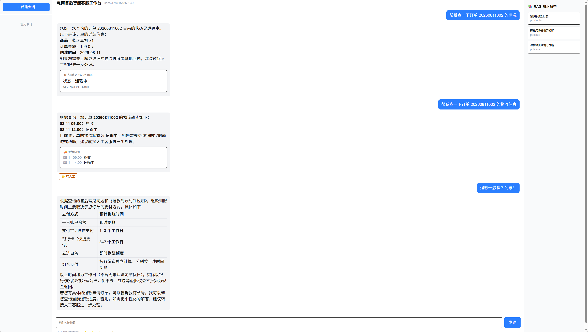
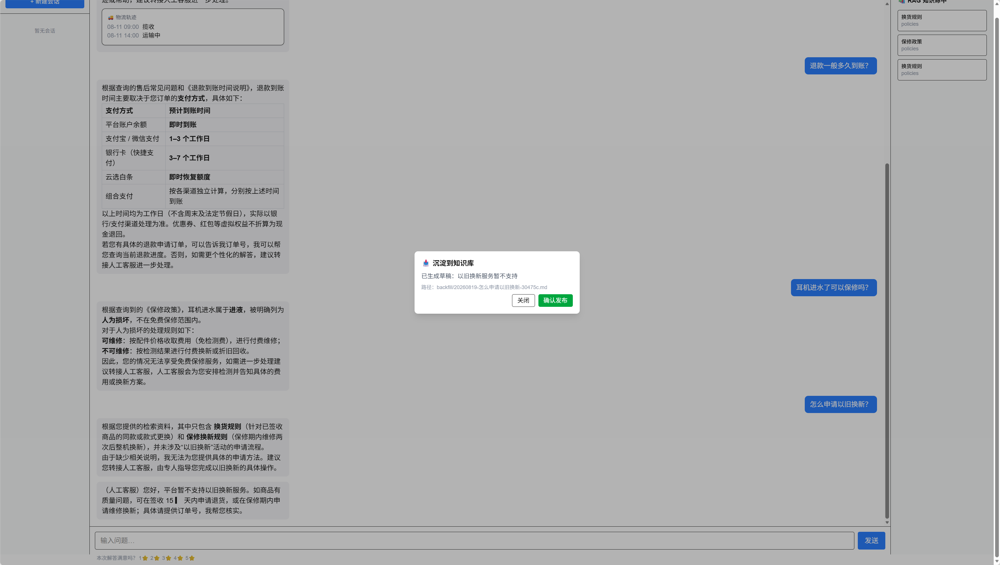
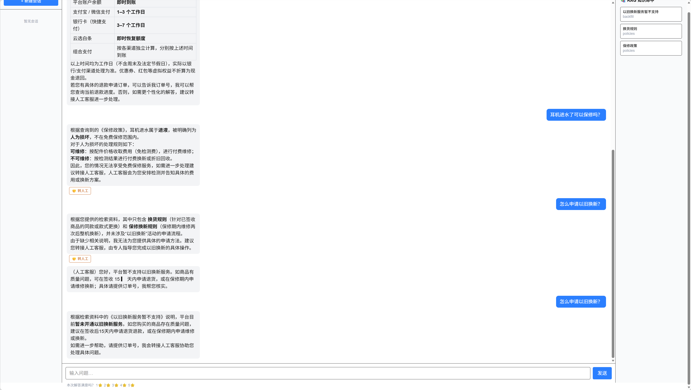

# 电商售后智能客服（LLM 应用开发求职作品集）

面向大模型应用开发岗位的求职作品集项目：一个带**工具调用**的电商售后智能客服。
用户问订单 / 物流 / 退换货问题时，系统不仅能基于知识库准确回答，还能实际**查订单、查物流、发起退款申请**，并带审核机制的多 Agent 协作。

## 架构一句话

`Next.js 前端（SSE 真流式）→ FastAPI + LangGraph 多 Agent（路由→工具→检索→前置质量闸门→流式写作）→ Qdrant 向量库 / SQLite 会话 / 语义缓存 / 工具调用（mock 订单库）`，全部经 Docker Compose 一键部署。

## 演示截图

**1. 客服对话（SSE 真流式输出 + 工具调用 + 多轮记忆）**

同一会话依次完成订单查询、物流查询、政策问答、转人工与知识沉淀，全流程真实跑测截图：







**2. 泛化评测报告（题库外新题泛化复测：总 92% / 新题 89% / 老题 94%）**

浏览器打开 [docs/eval-evidence-20260819.html](docs/eval-evidence-20260819.html) 即可查看 / 截图，或直接看[报告截图](docs/screenshots/eval-report.png)。

## 快速启动

前置：安装 Docker Desktop（Windows/macOS 自带 Compose）。

```bash
# 1. 配置密钥：把 .env.example 复制为 backend/.env，填入真实 Key
cp .env.example backend/.env

# 2. 一键起全栈（首次会构建镜像，建库需 1-2 分钟）
docker compose up --build -d

# 3. 查看日志，等后端完成知识库建索引后再使用
docker compose logs -f backend
```

## 访问地址

| 服务 | 地址 |
|------|------|
| 前端客服工作台 | http://localhost:3000 |
| 后端健康检查 | http://localhost:8000/api/v1/health |
| 后端指标 | http://localhost:8000/api/v1/metrics |
| Qdrant 控制台 | http://localhost:6333/dashboard |

## Key 配置

所有模型走国内云 API（DeepSeek / SiliconFlow）。Key 只存在于 `backend/.env`（docker 经 `env_file` 注入，不进镜像 / 代码）。

```bash
cp .env.example backend/.env
# 编辑 backend/.env 填入：
#   DEEPSEEK_API_KEY=sk-xxx
#   SILICONFLOW_API_KEY=sk-xxx
```

本地开发（不起 docker）时，后端默认降级为本地文件模式（`QDRANT_URL` 留空走 `qdrant_local/`，`DATABASE_URL` 默认 SQLite）。

`NEXT_PUBLIC_API_KEY` 是服务间认证 Key（dev 默认 `dev-local-key`，生产请通过环境变量配置）。

## 评测跑法

```bash
cd backend && .venv/Scripts/python -m eval.judge
```

> ⚠️ **评测前先停止后端服务**：Qdrant 本地模式（`qdrant_local/`）不支持多进程并发，若后端仍在运行，评测进程无法加载索引会**静默空检索**，导致准确率假性暴跌（实测 40%）。脚本已内置自检，被占用时会直接报错提示。跑完评测再启动后端即可。

当前评测集为 **78 题 / 6 类**（order 10、logistics 6、policy 22、product 18、chitchat 8、edge 14），知识库 116 个知识块。使用 SiliconFlow `deepseek-ai/DeepSeek-V4-Flash` 修复后完整跑测 **78/78 = 100%**（当次）；另做题库外泛化复测 50 题 **92%**（新题 16/18 = 89%、老题抽样 30/32 = 94%），证明系统非死记题库。

## 测试与 CI

- 后端：`cd backend && .venv/Scripts/python -m pytest tests -q`（149 用例，含缓存/闸门/会话/评分/流式/多轮上下文/域外拦截）
- 前端：`cd frontend && npm test`（Vitest 21 用例：SSE 解析/卡片/聊天窗口/多轮历史）＋ `npm run build`
- CI：`.github/workflows/ci.yml` 已备好——后端 pytest + 前端 build 每次 push 自动跑；评测 job 配好 GitHub Secrets（`DEEPSEEK_API_KEY`/`SILICONFLOW_API_KEY`）后 `workflow_dispatch` 手动触发。

## 面试叙事（3 句话）

1. 这是一个**带工具调用的电商售后智能客服**：用户问订单 / 物流 / 退款时，系统不止基于知识库回答，还能真实查订单、查物流、发起退款申请，并带审核机制的多 Agent 协作。
2. 技术上采用 **RAG + LangGraph 多 Agent + Function Calling 工具调用 + 商用工程化**：检索路由→向量召回→工具执行→前置质量闸门→流式写作（SSE 真流式，逐 token 推送、可中断），叠加会话持久化、语义缓存、评分反馈闭环、请求日志 / token 成本指标、模型重试与降级；并对慢输出做专项优化——订单号正则确定性快速路径免一次 LLM 调用、order 域跳过无效检索、LLM 调用加超时防挂起，首 token 实测 13-15s → 2-4s。
3. 关键数据：自建 78 题 / 6 类评测集 + LLM-as-judge，修复后完整实测 **78/78 = 100%**（当次）；题库外 18 道新题泛化复测 **89%**（总 92%）证明泛化能力；历史 25 题基线为 25/25（100%）。全链路 Docker Compose 一键部署。

## GitHub Flow

本项目按真实团队协作的 **GitHub Flow** 开发：每个任务走 `feature/task-N` 分支 → 实现 → 评审 → 合并回 `main`；本地已全量演练，配置好 GitHub 远端后可推真实 PR。
